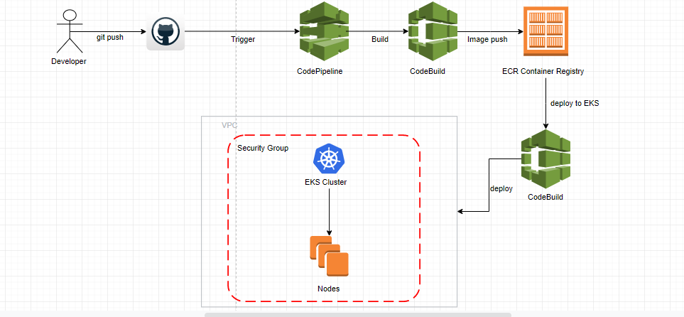

# NodeJS-Pipeline

 > Tools

- Github
- CodeBuild 
- CodePipeline 
- EKS 
- ECR 
- Cloudformation 
- IAM           

> App

- NodeJs Hello World Application.

> Infrastructure

- Set up services with cf scripts (cloudformation folder)

> CI

- Building to codes with buildspec.yaml and CodeBuild

> Orchestration

- Push Docker image from Codebuild to ECR
- Deploy last image in ECR to EKS Cluster using CodeBuild and buildspec-eks.yaml
- Autoscaling with scaling.yaml

## Pipeline Schema

